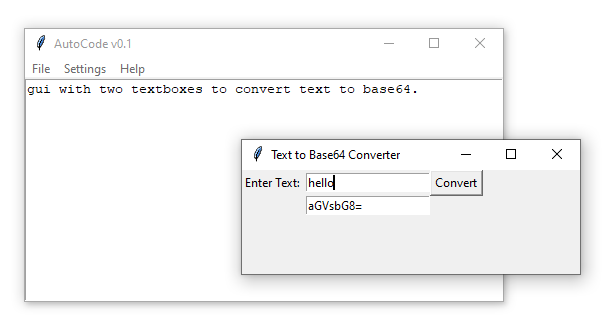

# AutoCode

AudoCode v0.1 By R.Hasaranga.

AutoCode is a ChatGPT based Python code generator. You can enter the requirement and this tool will generate the python code using ChatGPT. Generated code is not always the right one. Please check the code before you run it!

Before you begin, you need to acquire an API key from here: https://beta.openai.com/account/api-keys

